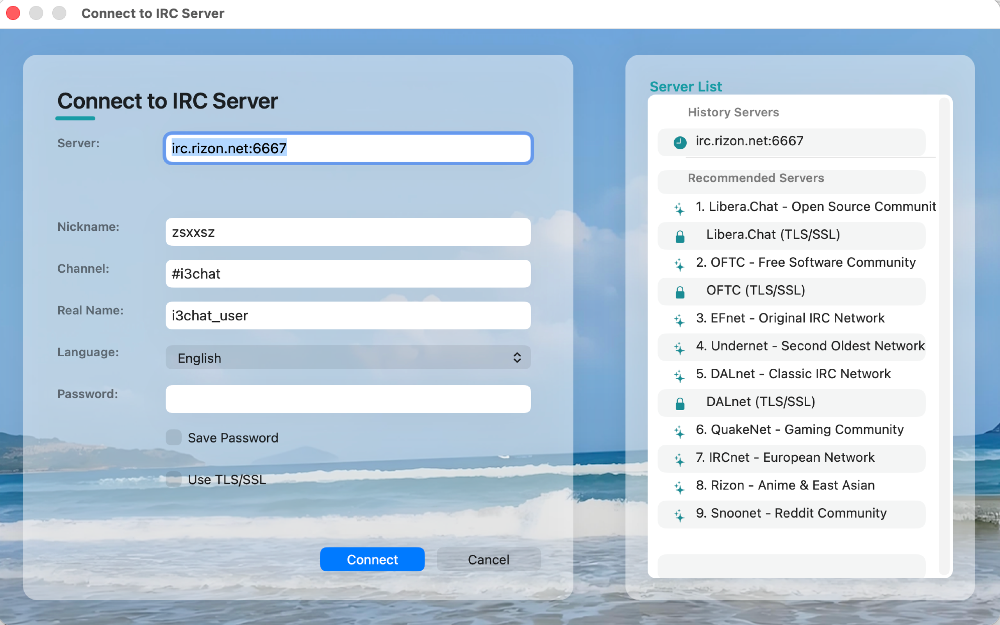
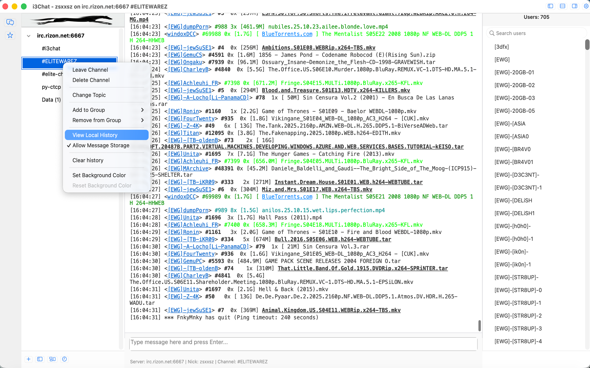
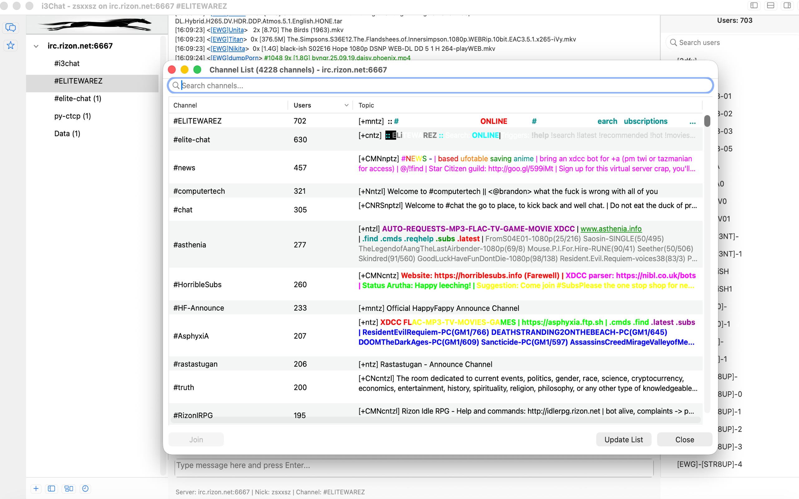
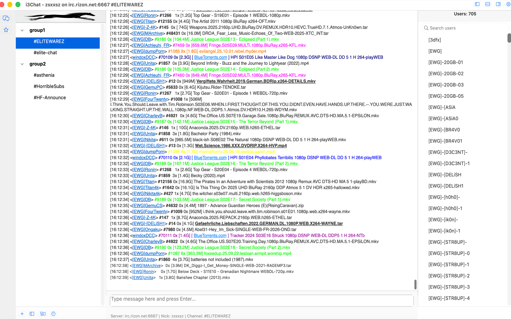
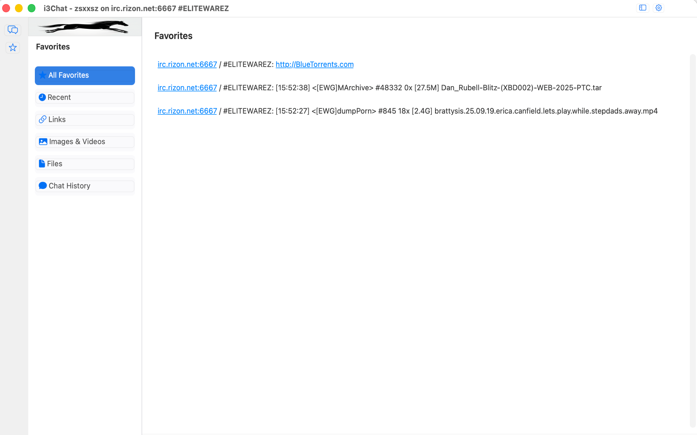
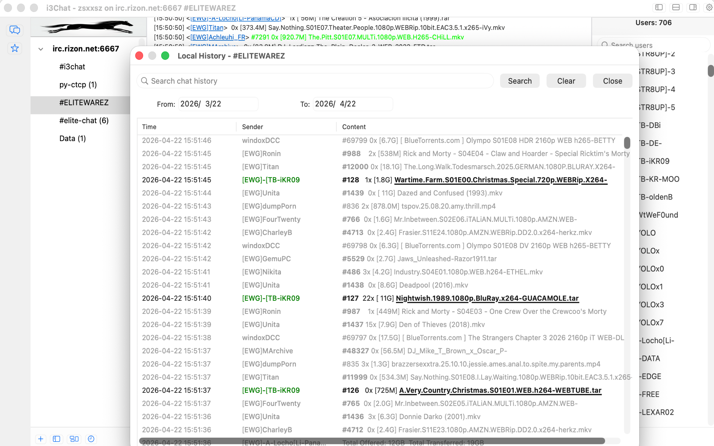
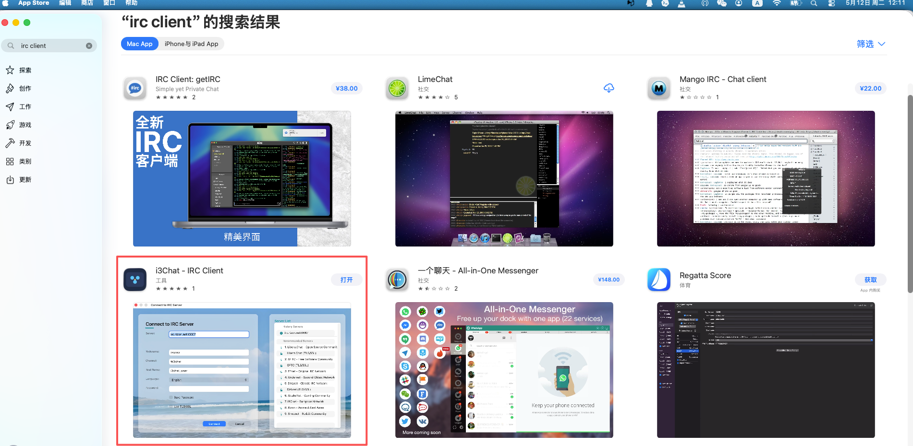

# i3Chat for macOS

An IRC client built specifically for macOS with a native Objective-C/AppKit interface.

[中文说明](#中文) | [English](#english)

## 中文

### 简介

i3Chat 是一款面向 macOS 的原生 IRC 客户端，使用 Objective-C + AppKit 开发，专注稳定连接、快速聊天和本地消息管理。

### 主要特点

- 原生 macOS 体验：基于 Cocoa/AppKit，窗口与菜单交互符合桌面应用习惯。
- 标准 IRC 协议支持：支持连接、注册、频道加入/退出、私聊、Notice、原始命令发送。
- TLS 安全连接：可在连接配置中启用 TLS（常见端口 6697）。
- 多窗口聊天管理：支持频道、私聊等会话分区显示，便于同时管理多个会话。
- 频道与用户视图：内置频道列表、用户列表，适合快速浏览和切换。
- 本地消息存储：使用 SQLite 保存消息与配置，支持历史查看与关键词搜索。
- 收藏与常用内容：支持收藏消息/条目，便于复用高频信息。
- WHOIS / LINKS / 频道列表：支持常见 IRC 服务器信息查询功能。
- 中英文界面：内置 English 与 Simplified Chinese 本地化。

### 截图















### 技术信息

- 语言：Objective-C (ARC)
- UI 框架：Cocoa / AppKit
- 存储：SQLite
- 最低系统：macOS 10.13+
- 工程：Makefile + Xcode 项目

### 快速开始（命令行）

```bash
make
./run.sh
```

构建完成后，应用位于：`build/i3Chat.app`

### 使用 Xcode

```bash
open i3Chat.xcodeproj
```

在 Xcode 中选择 `i3Chat` Scheme，使用 `Cmd+B` 编译，`Cmd+R` 运行。

### 常用命令

```bash
# 清理构建产物
make clean

# 构建 Universal 二进制
make build-universal

# 生成 DMG（x86_64 / arm64 / universal）
make build
```

### 项目结构

- `IRCClient/`：IRC 协议与连接逻辑
- `UI/`：窗口、聊天视图、频道/用户列表与设置
- `Storage/`：消息、收藏、配置的 SQLite 持久化
- `Resources/`：图标与本地化资源
- `third-party/sqlite/`：SQLite 源码与静态库构建

### 支持与反馈

- 支持文档：`support.md`、`support-zh.md`
- 问题反馈：<https://github.com/chat-client/i3chat/issues>

---

## English

### Overview

i3Chat is a native IRC client for macOS, built with Objective-C and AppKit. It focuses on reliable connections, smooth chat workflows, and local message management.

### Key Features

- Native macOS UX: built with Cocoa/AppKit for a desktop-first experience.
- Standard IRC workflow: connect/register, join/part channels, private chat, notices, and raw command sending.
- TLS support: secure IRC connections with optional TLS (commonly port 6697).
- Multi-conversation layout: manage channels and private chats side by side.
- Channel/User panels: quickly browse channels and active users.
- Local persistence with SQLite: store messages and settings, then browse/search history.
- Favorites support: save useful chat items for quick access.
- IRC info tools: includes WHOIS, LINKS, and channel list capabilities.
- Bilingual UI: built-in English and Simplified Chinese localization.

### Screenshots


### Technical Notes

- Language: Objective-C (ARC)
- UI: Cocoa / AppKit
- Storage: SQLite
- Minimum OS: macOS 10.13+
- Build systems: Makefile and Xcode project

### Quick Start (CLI)

```bash
make
./run.sh
```

After building, the app bundle is available at: `build/i3Chat.app`

### Build with Xcode

```bash
open i3Chat.xcodeproj
```

Select the `i3Chat` scheme, then use `Cmd+B` to build and `Cmd+R` to run.

### Useful Commands

```bash
# Clean build artifacts
make clean

# Build universal binary
make build-universal

# Build DMG packages (x86_64 / arm64 / universal)
make build
```

### Project Layout

- `IRCClient/`: IRC protocol and connection logic
- `UI/`: windows, chat views, channel/user panels, settings
- `Storage/`: SQLite persistence for messages, favorites, and settings
- `Resources/`: icons and localization files
- `third-party/sqlite/`: SQLite source and static library build assets

### Support

- Support docs: `support.md`, `support-zh.md`
- Issue tracker: <https://github.com/chat-client/i3chat/issues>
